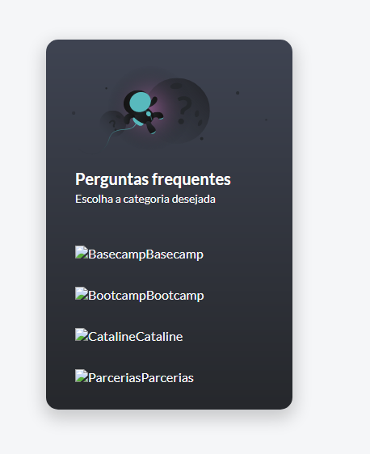

# Frontend - Desafio Vuex


Demo: https://cataline-vuex-desafio-45gfqs4p1-pvictorf.vercel.app/

### Telas
- Faq
- Busca
- Perguntas
- Resposta

### Conceitos e Técnicas utilizados
- Componentização
- Dynamic componentes
- Transitions
- Gerenciamento de Estado (Vuex)
- Conceitos de ES6 (filter e map)
- Transition
- CSS Grid
- Styled scoped
- Diretivas 
- Refs


## Project setup
```
npm install
```

### Compiles and hot-reloads for development
```
npm run dev
```

### Compiles and minifies for production
```
npm run build
```


