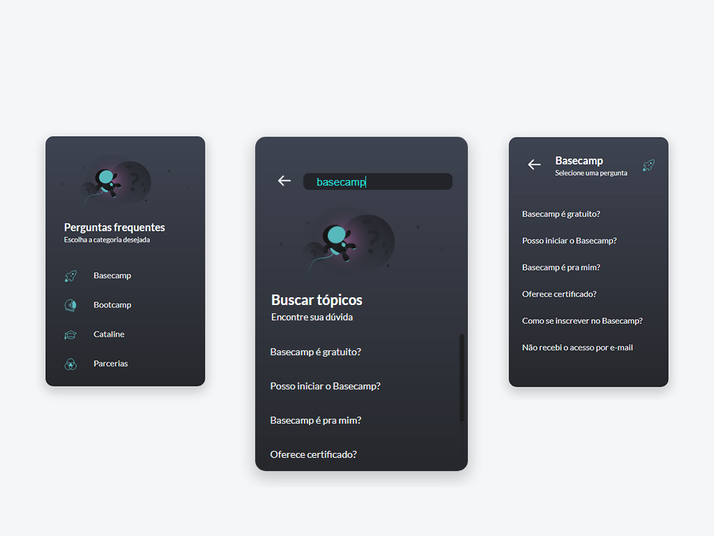

# Frontend - Desafio Vuex


Demo: https://cataline-vuex-desafio-45gfqs4p1-pvictorf.vercel.app/

## Project setup
```
npm install
```

### Compiles and hot-reloads for development
```
npm run dev
```

### Compiles and minifies for production
```
npm run build
```

### Lints and fixes files
```
npm run lint
```

### Customize configuration
See [Configuration Reference](https://cli.vuejs.org/config/).
